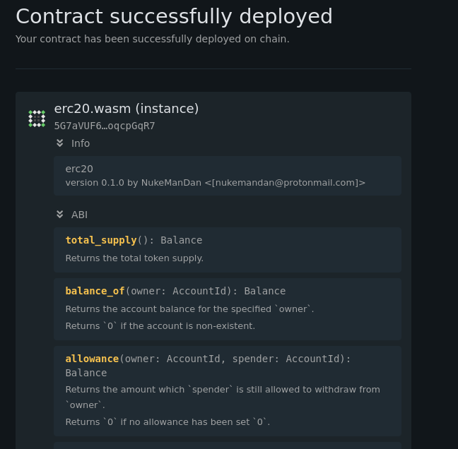
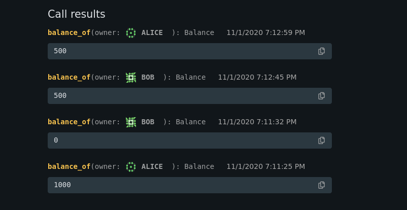
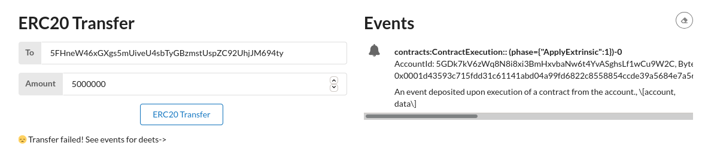
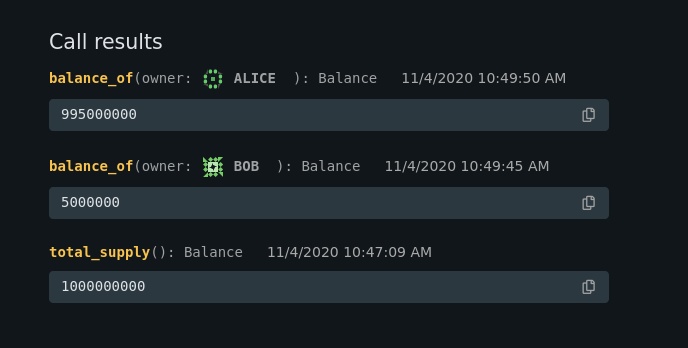

# Solution for [INTERMEDIATE CHALLENGE] Smart contracts - write an ERC-20 smart contract with ink!
## NukeManDan

### Node
See the `substrate-node-template` folder for the edits made to have the contracts pallet added

### ERC20 contract in ink!
Derived from the examples directly, see the `erc20` folder for the `/target/*` files with the compiled wasm and metadata needed.

### Front End
See the `substrate-front-end-template` folder for edits made to interact with the deployed ERC20 contract.

### Instructions to deploy and create and instance of the ERC20 contract 
- Compile the node
- Open up the [Canvas UI](https://paritytech.github.io/canvas-ui/)
  - Follow instructions from [this tutorial](https://substrate.dev/substrate-contracts-workshop/#/0/deploying-your-contract) to **upload** the `/erc20/target/erc20.wasm` file and `/erc20/target/erc20metadata.json` ABI file.
  - alternatively you can use the polkadot.js/apps interface
- **Deploy** a new contract with `1000000000` tokens from the `Alice` account.
- **COPY THE DEPLOYED INSTANCE HASH/ADDR** and replace the one in `ERC20.js` with this hash:
  - >const addr = '<your contract hash here>'

The Deployed Contract Address should be: `5G7aVUF6RhN1QWtLY7VHa32fSFWaA1oLGuMrjvTLoqcpGqR7`
  - NOTE: this may vary, be sure to get this from the [UI](https://paritytech.github.io/canvas-ui/#/execute) after you actually create an instance.

### Transfer the ERC20 with Canvas UI

Using the `Execute` tab from the UI, use the `Message to Send` = `transfer(to: AccountId, value: u128): Result<(), Error>)` and send `Bob` 500 units.

### Transfer the ERC20 with custom UI

Starting with a fresh chain (use `./target/release/node-template/purge-chain --dev -y` ), redelpoy the contract, but this time with 1000000000 tokens. We want to send `Bob` 5000000 this time.

> Be sure that you re-upload the contract via Canvas AND the hash is updated in `ERC20.js`!

See instructions in `substrate-front-end-template` to bring up the template. Then use the UI for the ERC20 to transfer funds!

> Note that the ballances is non functional for the ERC20 at this time. It will not display.

You should see a valid event to ContractExecution! If you get a DispatchError (specifically `index 9, error 12`), check if the address of the deployed contact is correct!

Check the balances via the Canvas UI:

